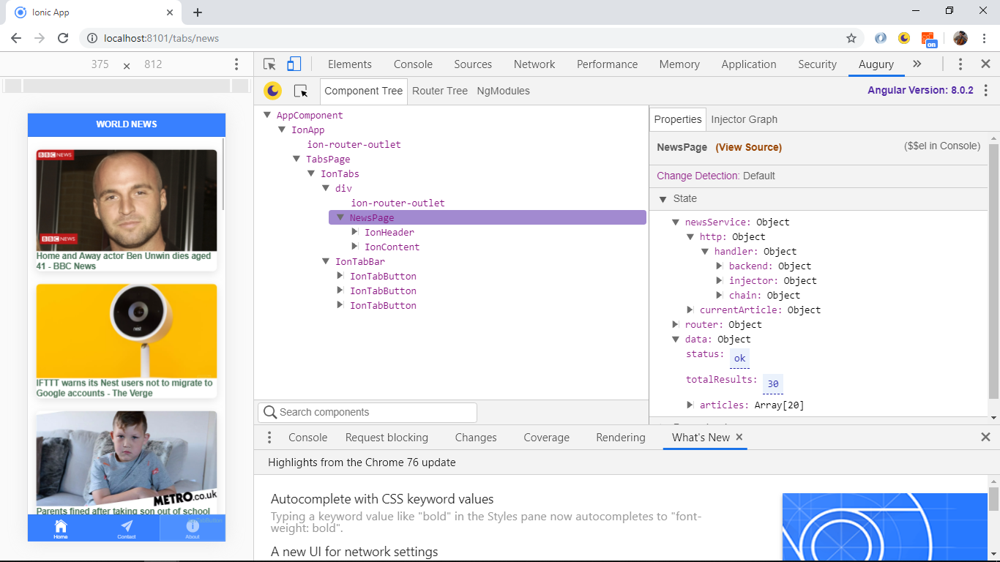
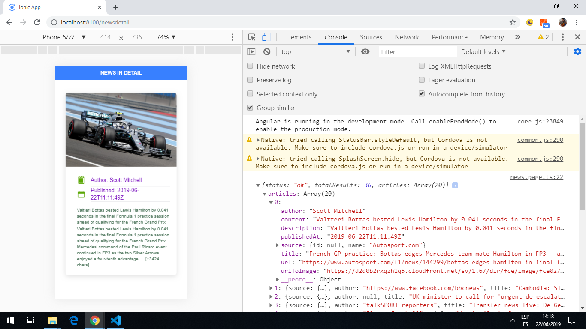
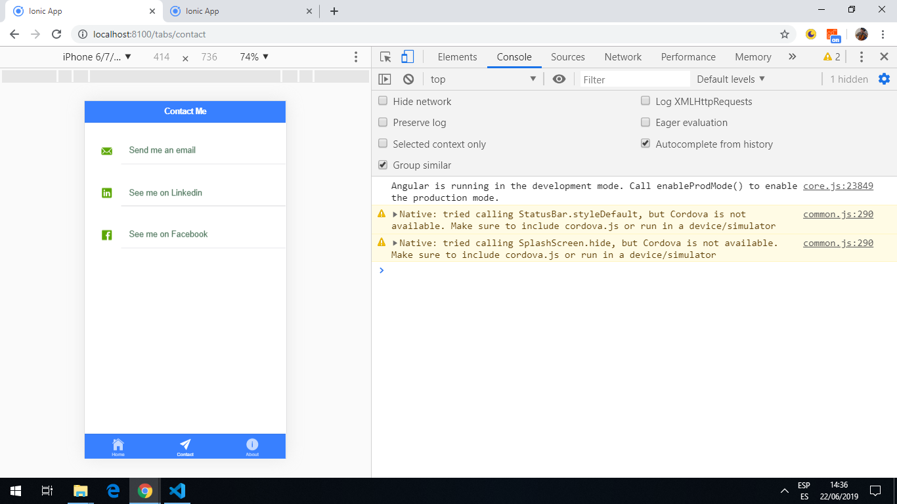
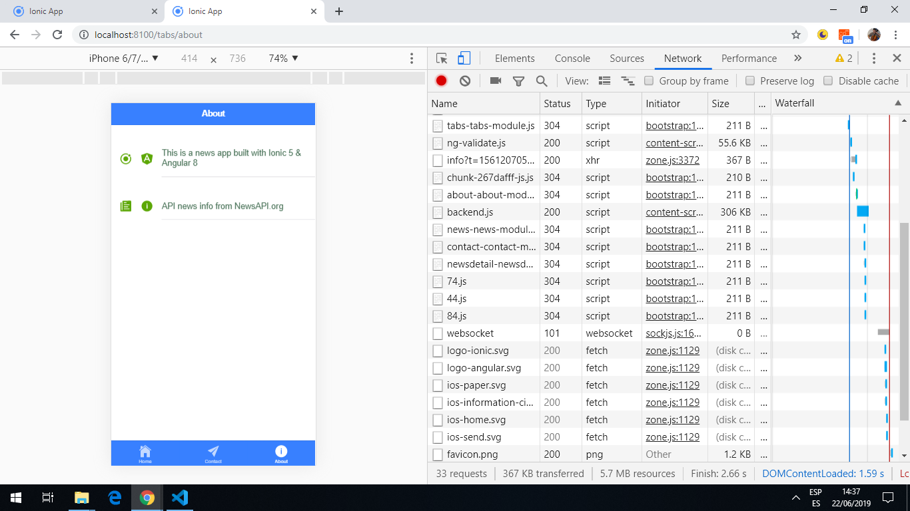

# :zap: Ionic Angular News

* App to search for and display news items from a [news API](https://newsapi.org/) using the [Ionic 5 framework](https://ionicframework.com/docs).
* **Note:** to open web links in a new window use: _ctrl+click on link_


## :page_facing_up: Table of contents

* [General info](#general-info)
* [Screenshots](#screenshots)
* [Technologies](#technologies)
* [Setup](#setup)
* [Features](#features)
* [Status](#status)
* [Inspiration](#inspiration)
* [Contact](#contact)

## :books: General info

* The [News API](https://newsapi.org/) is a simple HTTP REST API for searching and retrieving live articles from the web using:

1. Keyword or phrase
2. Date published
3. Source name
4. Source domain name
5. Language

## :camera: Screenshots






## :signal_strength: Technologies

* [Ionic v5](https://ionicframework.com/)
* [Ionic/angular v5](https://www.npmjs.com/package/@ionic/angular)
* [News REST API used to search for news articles](https://newsapi.org/) - only works in localhost. Paid subscription required if app is deployed

## :floppy_disk: Setup

* Add News API key to `environment.ts` - free News API will not work if deployed
* To start the server on _localhost://8100_ type: 'ionic serve'

## :computer: Code Examples

* Extract from `service.ts` that gets data from the API.

```typescript
export class NewsService {
  currentArticle: any;

  constructor(private http: HttpClient) {}

  getData(url: string): Observable<any> {
    const articleData = this.http.get(`${apiUrl}/${url}&apiKey=${apiKey}`).pipe(
      take(1),
      catchError((err) => {
        return throwError(
          "There was a problem fetching data from the news API, error: ",
          err
        );
      })
    );
    console.log("article Data: ", articleData);
    return articleData;
  }
}
```

* Extract from `news.page.ts` function to get API data with input url `'top-headlines?country=gb'`.

```typescript
ngOnInit() {
  this.newsService.getData('top-headlines?country=gb').subscribe(data => {
    console.log(data);
    this.data = data;
  });
}
```

## :cool: Features

* Cicking on an item in the news page routes to a news detail page with more information.
* API data service can be modified to search for news in other countries.

## :clipboard: Status & To-do list

* Status: Working.
* To-do: This app could be improved - add newsArticle interface and use Angular async in template instead of subscribe() for observables, for example. But it works and has taught me the news API basics. An improved news app will be created in a new repo: 'ionic-angular-news-app'.

## :clap: Inspiration

* Project initially inspired by [Baljeet Singh´s Youtube video 'Creating News Application With Ionic 4 and Angular'](https://www.youtube.com/watch?v=NJ9C7iY9350) but much improved upon. I do not recommend this video now - there are much better & more recent Ionic tutorials on Youtube - Simon Grimm or Josh Morony for example.

## :file_folder: License

* This project is licensed under the terms of the MIT license.

## :envelope: Contact

* Repo created by [ABateman](https://github.com/AndrewJBateman), email: gomezbateman@yahoo.com
