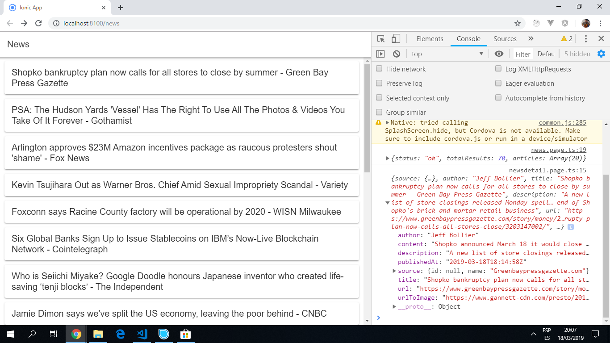

# Ionic Angular News

App to search for and display news items from an [API](https://newsapi.org/) using the [Ionic 5 framework](https://ionicframework.com/docs).

## Table of contents

* [General info](#general-info)
* [Screenshots](#screenshots)
* [Technologies](#technologies)
* [Setup](#setup)
* [Features](#features)
* [Status](#status)
* [Inspiration](#inspiration)
* [Contact](#contact)

## General info

## Screenshots

## Technologies

* [Ionic v5.7.0](https://ionicframework.com/)

* [Ionic/angular v4.4.2](https://www.npmjs.com/package/@ionic/angular)

## Setup

* To start the server on _localhost://8100_ type: 'ionic serve'

## Code Examples

* Example 1

## Features

* API: search for news item using a keyword search.

## Status & To-do list

* Status: Part Working. Compiles & News page loads, clicking on article does not lead to the news detail page. Footer are horizontal and not visible.

* To-do: Fix code. Change tabs to new system. Add more detail/styling to front page.

## Inspiration

Project inspired by [Baljeet Singh´s Youtube video 'Creating News Application With Ionic 4 and Angular'](https://www.youtube.com/watch?v=NJ9C7iY9350).

## Contact

Repo created by [ABateman](https://www.andrewbateman.org) - feel free to contact me!
