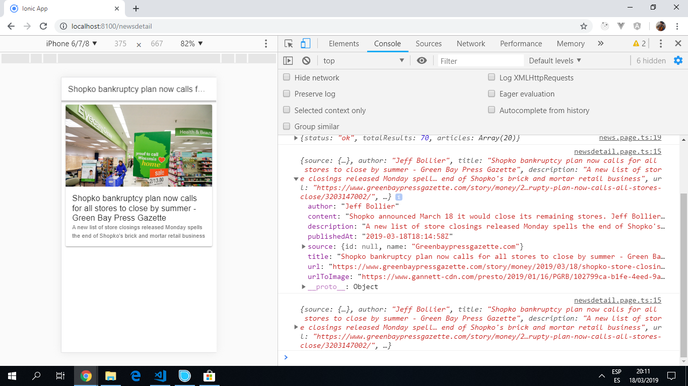

# Ionic Angular News

Ionic 5 app to search for and display news items from an [API](https://newsapi.org/) using the [Ionic 5 framework](https://ionicframework.com/docs).

## Table of contents

* [General info](#general-info)
* [Screenshots](#screenshots)
* [Technologies](#technologies)
* [Setup](#setup)
* [Features](#features)
* [Status](#status)
* [Inspiration](#inspiration)
* [Contact](#contact)

## General info

* The [News API](https://newsapi.org/) is a simple HTTP REST API for searching and retrieving live articles from the web using:

1. Keyword or phrase
2. Date published
3. Source name
4. Source domain name
5. Language

## Screenshots





## Technologies

* [Ionic v5.8.0](https://ionicframework.com/)

* [Ionic/angular v4.5.0](https://www.npmjs.com/package/@ionic/angular)

* [News REST API used to search for news articles](https://newsapi.org/)

## Setup

* To start the server on _localhost://8100_ type: 'ionic serve'

## Code Examples

* Extract from `service.ts` file that gets data from the API.

```typescript
export class NewsService {
  currentArticle: any;

  constructor(private http: HttpClient) {}

  getData(url) {
    return this.http.get(`${apiUrl}/${url}&apiKey=${apiKey}`);
  }
}

```

## Features

* Cicking on an item in the news page routes to a news detail page with more information.

* API data service can be modified to search for news in other countries.

## Status & To-do list

* Status: Working. Can be improved.

* To-do: Add *ngIf to only show section if API section !== null. Add footer on news detail page and/or back button.Add 'further info' button with web links to articles. Add function to format date shown. Set maximum size of news image. Add scroll bar. Observables. Consider search bar and language menu. Add link to email and linkedin buttons.

## Inspiration

Project initially inspired by [Baljeet Singh´s Youtube video 'Creating News Application With Ionic 4 and Angular'](https://www.youtube.com/watch?v=NJ9C7iY9350) but much improved upon.

## Contact

Repo created by [ABateman](https://www.andrewbateman.org) - feel free to contact me!
